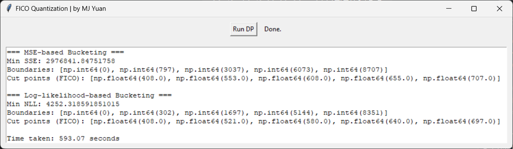

# FICO Quantization GUI

A desktop application that demonstrates dynamic programming (DP) techniques for quantizing FICO scores using prefix sum methods. The application computes optimal bucket boundaries based on two criteria: Mean Squared Error (MSE) and negative log-likelihood. It then displays the results in an interactive Tkinter GUI.


## Features

- **Dynamic Programming with Prefix Sums**:  
  Implements efficient DP algorithms to compute bucket boundaries for FICO scores based on:
  - **MSE-based Bucketing**: Minimizes the sum of squared errors.
  - **Log-Likelihood-based Bucketing**: Minimizes the negative log-likelihood for default rates.
  
- **Interactive GUI**:  
  A simple, responsive Tkinter GUI that:
  - Loads data from a CSV file.
  - Runs the DP algorithms in a background thread to keep the interface responsive.
  - Displays the computed bucket boundaries, cut points, and processing time in a text output widget.
  
- **Multithreading**:  
  Uses Python’s `threading` module to execute time-consuming computations without blocking the main GUI thread.

## Requirements

- **Python 3.x**
- **Tkinter** (included with most Python installations)
- **Pandas**: For data manipulation.
- **NumPy**: For efficient numerical computation.

Install the required Python packages using pip (if not already installed):

```bash
pip install pandas numpy
```

## File Structure
```bash
FICOQuantizationGUI/
├── FICOQuantizationGUI.py
├── .gitattributes
├── .gitignore
├── LICENSE
├── Task 3 and 4_Loan_Data.csv
├── screenshot.png
└── README.md
```

## Usage
1. Prepare the Data:
- Ensure that the CSV file (Task 3 and 4_Loan_Data.csv) is in the same directory as the script. The CSV should contain at least the following columns:
  - fico_score
  - default
2. Run the Application:
- Execute the script from the terminal or command prompt:
  ```bash
  python FICOQuantizationGUI.py
  ```
3. Using the GUI:
- Click the "Run DP" button to start the quantization process.
- The application loads the data, computes the DP solutions for both MSE-based and log-likelihood-based bucketing, and displays the results in the output text box.
- Progress messages and the elapsed time for computation are shown in the GUI.

## License
This project is licensed under the MIT License. See the LICENSE file for details.

## Acknowledgments
- Tkinter: For providing a simple and effective GUI toolkit for Python.
- Pandas & NumPy: For powerful data manipulation and numerical computation capabilities.
- The open-source community for the continual development and support of these robust libraries.


